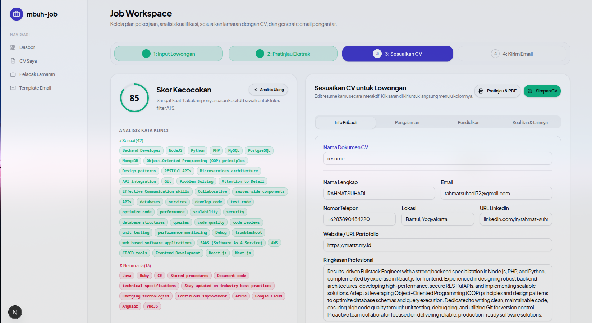
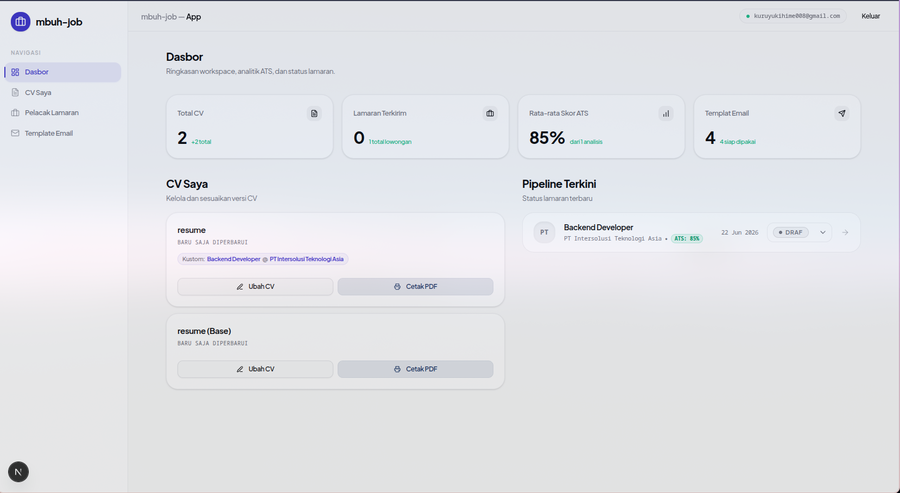
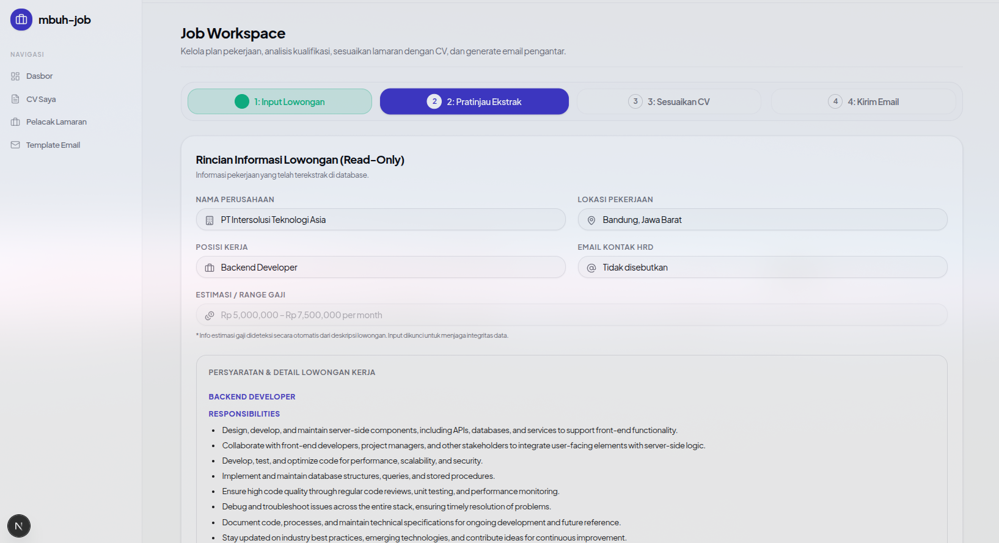

# AI CV ATS Optimization & Job Application Tracker


A web-based system designed to streamline the job application process. It converts resumes (CVs) into structured JSON, parses job listings, computes ATS compatibility scores, and provides interactive, in-place CV tailoring alongside automated cover letter generation.

## Preview

<p align="center">
  
  
  
</p>

## Key Capabilities

* **CV PDF Parsing**: Extracts text content from PDF uploads and uses AI to map details into a structured, unified JSON schema (personal info, experiences, education, and skills/achievements).
* **ATS Compatibility Matcher**: Scores CV alignment against specific job descriptions, highlights missing keywords, and flags critical qualification dealbreakers (e.g., degree levels, language requirements).
* **Interactive CV Editor**: Allows direct inline editing of structured CV data, synced side-by-side with AI-driven optimization suggestions.
* **Job Application CRM**: Minimizes entry overhead by using a single-field raw text parser (for LinkedIn or social media job ads) to extract metadata (company, position, contact email) and track application pipelines (Draft, Applied, Interview, Offer, Rejected).
* **AI Cover Letter Generator**: Customizes professional application emails based on tailored CV data and configurable templates.

## Tech Stack

* **Core Framework**: Next.js 16 (App Router)
* **Database & Authentication**: Supabase (PostgreSQL, GoTrue, SSR Integration)
* **Styling**: Tailwind CSS v4, PostCSS, and shadcn/ui
* **AI SDKs**: Official `@google/genai` (Gemini) and `openai` (OpenAI / Local LLM Gateway fallback)
* **Development Tooling**: Biome (Linter and Formatter), TypeScript, pnpm

## Getting Started

### Prerequisites

* Node.js (Version defined in `.nvmrc` if present)
* pnpm (v10+)
* Supabase instance

### Environment Setup

Create a `.env.local` or `.env` file in the root directory:

```env
NEXT_PUBLIC_SUPABASE_URL=your_supabase_url
NEXT_PUBLIC_SUPABASE_PUBLISHABLE_KEY=your_supabase_anon_key

# Choose AI provider by setting the respective key.
# Priority goes to GEMINI_API_KEY if both are present.
GEMINI_API_KEY=your_gemini_api_key
GEMINI_MODEL=gemini-2.5-flash

# Fallback / OpenAI configuration
OPENAI_API_KEY=your_openai_api_key
OPENAI_BASE_URL=http://localhost:20128/v1
OPENAI_MODEL=gemini/gemini-3.1-flash-lite-preview
```

### Installation

1. Install project dependencies:
   ```bash
   pnpm install
   ```

2. Start the local development server:
   ```bash
   pnpm dev
   ```

3. Open [http://localhost:3000](http://localhost:3000) in your browser.

## Codebase Conventions

* **Atomic Design**: Components are structured incrementally as atoms, molecules, organisms, and templates.
* **Separation of Concerns**: Business logic is decoupled from presentational UI. Direct logic goes into hooks (`src/hooks`) or dedicated server actions (`src/actions`).
* **Formatting & Linting**: Code formatting and verification are enforced by Biome. Run verification checks before committing:
  ```bash
  pnpm lint
  pnpm format
  ```
